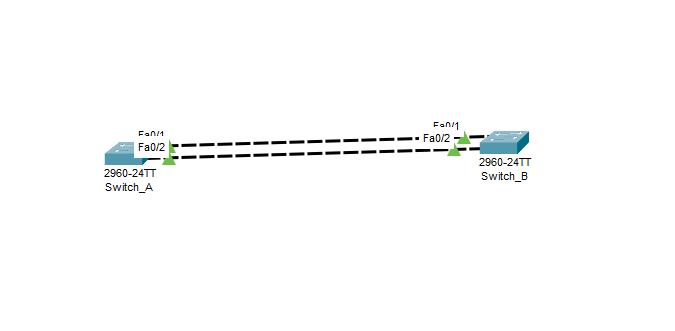

# CCNA-Lab03

# STP, RSTP & EtherChannel Lab - Cisco CCNA

Ovaj repozitorijum sadrži praktične konfiguracije i laboratorijske vježbe za **Spanning Tree Protocol (STP)**, **Rapid Spanning Tree Protocol (RSTP)** i **EtherChannel (LACP)** tehnologije u okviru pripreme za Cisco CCNA sertifikat.



---

## Topologija i Ciljevi Laboratorijske Vježbe

Lab se sastoji od dva Cisco Catalyst switcha povezana redundantnim FastEthernet linkovima (`Fa0/1` i `Fa0/2`) sa ciljem postizanja visoke dostupnosti (High Availability) i eliminacije petlji na sloju 2.

### Glavni ciljevi

1. **Migracija na RSTP** – prelazak sa sporog IEEE 802.1D standarda na brzi IEEE 802.1w protokol radi konvergencije u milisekundama.
2. **Deterministički Root Bridge** – ručno postavljanje primarnog Root Bridge uređaja promjenom STP prioriteta na vrijednost 4096.
3. **Agregacija linkova (EtherChannel)** – objedinjavanje više fizičkih linkova u jedan logički Port-Channel korištenjem otvorenog standarda **LACP**.
4. **Optimizacija Edge portova** – ubrzavanje povezivanja krajnjih uređaja pomoću **PortFast** funkcije uz zaštitu preko **BPDU Guard** mehanizma.
5. **Troubleshooting** – rješavanje Packet Tracer anomalije i prebacivanje STP veze iz `Shared (Shr)` u `Point-to-Point (P2p)` režim rada.

---

## SWITCH_A (Root Bridge)

Konfiguracija glavnog switcha koji će postati Root Bridge za VLAN 1.

```ios
enable
configure terminal

! Aktiviranje Rapid-PVST (RSTP)
spanning-tree mode rapid-pvst

! Postavljanje Root Bridge-a za VLAN 1
spanning-tree vlan 1 priority 4096

! Kreiranje EtherChannel-a pomoću LACP (Active)
interface range fastEthernet 0/1 - 2
 switchport mode access
 channel-group 1 mode active
exit

! Konfiguracija Port-Channel interfejsa
interface port-channel 1
 switchport mode trunk

 ! Forsiranje Point-to-Point tipa veze
 spanning-tree link-type point-to-point
end

write memory
```

---

## SWITCH_B

Konfiguracija drugog switcha koji učestvuje u EtherChannel grupi.

```ios
enable
configure terminal

! Aktiviranje Rapid-PVST (RSTP)
spanning-tree mode rapid-pvst

! Kreiranje EtherChannel-a pomoću LACP (Passive)
interface range fastEthernet 0/1 - 2
 switchport mode access
 channel-group 1 mode passive
exit

! Konfiguracija Port-Channel interfejsa
interface port-channel 1
 switchport mode trunk

 ! Forsiranje Point-to-Point tipa veze
 spanning-tree link-type point-to-point
end

write memory
```

---

## Konfiguracija Edge Porta (PortFast + BPDU Guard)

Primjenjuje se na portove na koje su povezani krajnji uređaji (PC, laptop, printer i slično).

```ios
enable
configure terminal

interface fastEthernet 0/5
 switchport mode access
 spanning-tree portfast
 spanning-tree bpduguard enable
end

write memory
```

---

## Verifikacija Konfiguracije

Provjera statusa STP-a:

```ios
show spanning-tree
```

Provjera EtherChannel-a:

```ios
show etherchannel summary
```

Provjera Port-Channel interfejsa:

```ios
show interfaces port-channel 1
```

Provjera STP Root Bridge-a:

```ios
show spanning-tree vlan 1
```

---

## Očekivani Rezultati

- RSTP radi u Rapid-PVST modu.
- SWITCH_A je Root Bridge za VLAN 1.
- FastEthernet interfejsi Fa0/1 i Fa0/2 agregirani su u Port-Channel 1.
- EtherChannel koristi LACP protokol.
- STP prikazuje vezu kao **Point-to-Point (P2p)**.
- PortFast omogućava trenutno aktiviranje edge portova.
- BPDU Guard automatski gasi port ukoliko primi BPDU paket na korisničkom portu.
- Redundantnost i otpornost mreže postižu se bez Layer 2 petlji.

---
